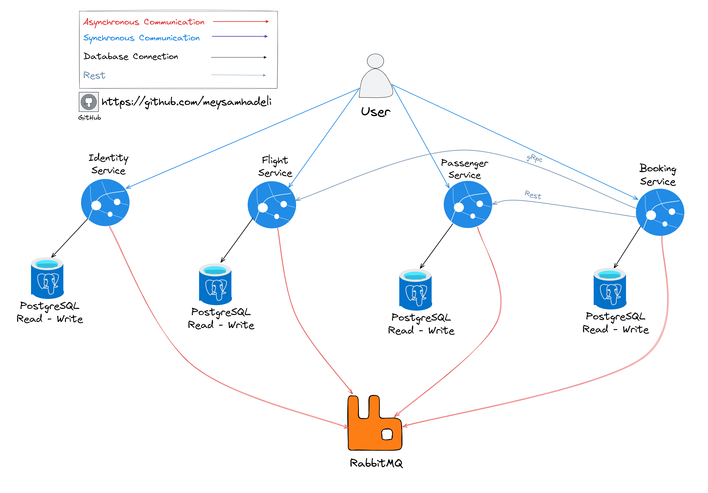

<div align="center" style="margin-bottom:20px">
  
    <div align="center">
                       <a href="https://github.com/meysamhadeli/booking-microservices-express-js/blob/main/LICENSE"></a>
    </div>
</div>
           
> **The main idea of creating this project is implementing an infrastructure for up and running distributed system with the latest technology and architecture like Vertical Slice Architecture, Event Driven Architecture, CQRS, Postgres, RabbitMq and Express in Node.Js, and we will not deal mainly with business.** 🚀

<a href="https://gitpod.io/#https://github.com/meysamhadeli/booking-microservices-express"></a>

# Table of Contents

- [The Goals of This Project](#the-goals-of-this-project)
- [Plan](#plan)
- [Technologies - Libraries](#technologies---libraries)
- [The Domain and Bounded Context - Service Boundary](#the-domain-and-bounded-context---service-boundary)
- [Structure of Project](#structure-of-project)
- [How to Run](#how-to-run)
  - [Docker Compose](#docker-compose)
- [Support](#support)
- [Contribution](#contribution)

## The Goals of This Project

- :sparkle: Using `Vertical Slice Architecture` for `architecture` level.
- :sparkle: Using `Rabbitmq` on top of `amqp` for `Event Driven Architecture` between our microservices.
- :sparkle: Using `Rest` for `internal communication` between our microservices with 'axios'.
- :sparkle: Using `CQRS` implementation with `MediatrJs` internal library.
- :sparkle: Using `Express` for `web framework`.
- :sparkle: Using `Postgres` for database level with `typeorm`.
- :sparkle: Using `Unit Testing`, `Integration Testing`, `End To End Testing` for testing level.
- :sparkle: Using `Joi` for `validation` of our handlers.
- :sparkle: Using `Docker-Compose` for our `deployment` mechanism.
- :sparkle: Using `winston` and 'morgan' for `logging`.
- :sparkle: Using `Jaeger` on top of `OpenTelemetry` for `tracing`.
- :sparkle: Using `Prometteuse` and `Grafana` on top of `OpenTelemetry` for `monitoring`.
- :sparkle: Using `passport` for authentication and authorization base on `JWT`.
- :sparkle: Using `swagger-ui-express` and `tsoa` for generate `api documentation` automaticly.
- :sparkle: Using `ts-mapper` for `mapping` our objects.
- :sparkle: Using `Problem Details` standard for `readable details of errors`.
- :sparkle: Using `eslint` and `prettier` for `formatting` of our code.
- :sparkle: Using `tsyringe` for handeling dependency injection.

## Plan

> 🌀This project is a work in progress, new features will be added over time.🌀

I will try to register future goals and additions in the [Issues](https://github.com/meysamhadeli/booking-microservices/issues) section of this repository.

High-level plan is represented in the table

| Feature           | Status         |
| ----------------- | -------------- |
| Identity Service  | Completed ✔️   |
| Flight Service    | Completed ✔️   |
| Passenger Service | Completed ✔️   |
| Booking Service   | Completed ✔️   |
| Building Blocks   | Completed ✔️   |

## Technologies - Libraries
- ✔️ **[`microsoft/TypeScript`](https://github.com/microsoft/TypeScript)** - TypeScript is a language for application-scale JavaScript.
- ✔️ **[`expressjs/express`](https://github.com/expressjs/express)** - Fast, unopinionated, minimalist web framework for Node.js
- ✔️ **[`typeorm/typeorm`](https://github.com/typeorm/typeorm)** - TypeORM is highly influenced by other ORMs, such as Hibernate, Doctrine and Entity Framework
- ✔️ **[`amqp-node/amqplib`](https://github.com/amqp-node/amqplib)** - A library for making AMQP 0-9-1 clients for Node.JS
- ✔️ **[`microsoft/tsyringe`](https://github.com/microsoft/tsyringe)** - A lightweight dependency injection container for TypeScript/JavaScript for constructor injection
- ✔️ **[`open-telemetry/opentelemetry-js`](https://github.com/open-telemetry/opentelemetry-js)** - A framework for collecting traces, metrics, and logs from applications
- ✔️ **[`siimon/prom-client`](https://github.com/siimon/prom-client)** - A prometheus client for Node.js that supports histogram, summaries, gauges and counters
- ✔️ **[`scottie1984/swagger-ui-express`](https://github.com/scottie1984/swagger-ui-express)** - Serve auto-generated swagger-ui generated API docs from express
- ✔️ **[`lukeautry/tsoa`](https://github.com/lukeautry/tsoa)** - OpenAPI-compliant REST APIs using TypeScript and Node
- ✔️ **[`axios/axios`](https://github.com/axios/axios)** - Promise based HTTP client for the browser and node.js
- ✔️ **[`motdotla/dotenv`](https://github.com/motdotla/dotenv)** - Dotenv is a zero-dependency module that loads environment variables from a .env
- ✔️ **[`PDMLab/http-problem-details`](https://github.com/PDMLab/http-problem-details)** - This library implements HTTP Problem details (RFC 7807) for HTTP APIs
- ✔️ **[`helmetjs/helmet`](https://github.com/helmetjs/helmet)** - Helmet helps secure Express apps by setting HTTP response headers
- ✔️ **[`hapijs/joi`](https://github.com/hapijs/joi)** - The most powerful schema description language and data validator for JavaScript
- ✔️ **[`expressjs/morgan`](https://github.com/expressjs/morgan)** - HTTP request logger middleware for node.js
- ✔️ **[`winstonjs/winston`](https://github.com/winstonjs/winston)** - A logger for just about everything
- ✔️ **[`jestjs/jest`](https://github.com/jestjs/jest)** - A javascript framework for testing
- ✔️ **[`testcontainers/testcontainers-node`](https://github.com/testcontainers/testcontainers-node)** - A library to support tests with throwaway instances of Docker containers
- ✔️ **[`faker-js/faker`](https://github.com/faker-js/faker)** - Generate massive amounts of fake (but realistic) data for testing and development
- ✔️ **[`florinn/typemoq`](https://github.com/florinn/typemoq)** - Simple mocking library for JavaScript targeting TypeScript development
- ✔️ **[`ladjs/supertest`](https://github.com/ladjs/supertest)** - High-level abstraction for testing HTTP
- ✔️ **[`eslint/eslint`](https://github.com/eslint/eslint)** - ESLint is a tool for identifying and reporting on patterns found in ECMAScript/JavaScript code
- ✔️ **[`prettier/prettier`](https://github.com/prettier/prettier)** - Opinionated Code Formatter
- ✔️ **[`vercel/async-retry`](https://github.com/vercel/async-retry)** - Retrying made simple, easy, and async

## The Domain And Bounded Context - Service Boundary

- `Identity Service`: The Identity Service is a bounded context for the authentication and authorization of users using [passport](https://github.com/jaredhanson/passport). This service is responsible for creating new users and their corresponding roles and permissions using Jwt for authentication and authorization.

- `Flight Service`: The Flight Service is a bounded context `CRUD` service to handle flight related operations.

- `Passenger Service`: The Passenger Service is a bounded context for managing passenger information, tracking activities and subscribing to get notification for out of stock products.

- `Booking Service`: The Booking Service is a bounded context for managing all operation related to booking ticket.



## Structure of Project

In this project I used a mix of [clean architecture](https://jasontaylor.dev/clean-architecture-getting-started/), [vertical slice architecture](https://jimmybogard.com/vertical-slice-architecture/) and I used [feature folder structure](http://www.kamilgrzybek.com/design/feature-folders/) to structure my files.

Each microservice has its dependencies such as databases, files etc. Each microservice is decoupled from other microservices and developed and deployed separately. Microservices talk to each other with Rest or gRPC for synchronous calls and use RabbitMq or Kafka for asynchronous calls.

We have a separate microservice `Identity` for authentication and authorization of each request. Once signed-in users are issued a JWT token. This token is used by other microservices to validate the user, read claims and allow access to authorized/role specific endpoints.

I used [RabbitMQ](https://github.com/rabbitmq) as my MessageBroker for async communication between microservices using the eventual consistency mechanism. Each microservice uses [amqp](https://github.com/amqp-node/amqplib) to interface with [RabbitMQ](https://github.com/rabbitmq) providing, messaging, availability, reliability, etc.

Microservices are `event based` which means they can publish and/or subscribe to any events occurring in the setup. By using this approach for communicating between services, each microservice does not need to know about the other services or handle errors occurred in other microservices.

I treat each request as a distinct use case or slice, encapsulating and grouping all concerns from front-end to back.
When adding or changing a feature in an application in n-tire architecture, we are typically touching many "layers" in an application. We are changing the user interface, adding fields to models, modifying validation, and so on. Instead of coupling across a layer, we couple vertically along a slice. We `minimize coupling` `between slices`, and `maximize coupling` `in a slice`.

With this approach, each of our vertical slices can decide for itself how to best fulfill the request. New features only add code, we're not changing shared code and worrying about side effects.

<div align="center">
  
</div>

Instead of grouping related action methods in one controller, as found in traditional ASP.net controllers, I used the [REPR pattern](https://deviq.com/design-patterns/repr-design-pattern). Each action gets its own small endpoint, consisting of a route, the action, and an `IMediator` instance (see [MediatR](https://github.com/jbogard/MediatR)). The request is passed to the `IMediator` instance, routed through a [`Mediatr pipeline`](https://lostechies.com/jimmybogard/2014/09/09/tackling-cross-cutting-concerns-with-a-mediator-pipeline/) where custom [middleware](https://github.com/jbogard/MediatR/wiki/Behaviors) can log, validate and intercept requests. The request is then handled by a request specific `IRequestHandler` which performs business logic before returning the result.

The use of the [mediator pattern](https://dotnetcoretutorials.com/2019/04/30/the-mediator-pattern-in-net-core-part-1-whats-a-mediator/) in my controllers creates clean and [thin controllers](https://codeopinion.com/thin-controllers-cqrs-mediatr/). By separating action logic into individual handlers we support the [Single Responsibility Principle](https://en.wikipedia.org/wiki/Single_responsibility_principle) and [Don't Repeat Yourself principles](https://en.wikipedia.org/wiki/Don%27t_repeat_yourself), this is because traditional controllers tend to become bloated with large action methods and several injected `Services` only being used by a few methods.

I used CQRS to decompose my features into small parts that makes our application:

- Maximize performance, scalability and simplicity.
- Easy to maintain and add features to. Changes only affect one command or query, avoiding breaking changes or creating side effects.
- It gives us better separation of concerns and cross-cutting concern (with help of mediatr behavior pipelines), instead of bloated service classes doing many things.

Using the CQRS pattern, we cut each business functionality into vertical slices, for each of these slices we group classes (see [technical folders structure](http://www.kamilgrzybek.com/design/feature-folders)) specific to that feature together (command, handlers, infrastructure, repository, controllers, etc). In our CQRS pattern each command/query handler is a separate slice. This is where you can reduce coupling between layers. Each handler can be a separated code unit, even copy/pasted. Thanks to that, we can tune down the specific method to not follow general conventions (e.g. use custom SQL query or even different storage). In a traditional layered architecture, when we change the core generic mechanism in one layer, it can impact all methods.

## How to Run

> ### Docker

#### Docker Compose

Run our infrastructure with docker using the [infrastructure.yaml](./deployments/docker-compose/infrastructure.yaml) file with the below command at the root of app:

```bash
docker-compose -f ./deployments/docker-compose/infrastructure.yaml up -d
```
##### Todo
I will add `docker-compsoe` for up and running whole app here in the next...

### Documentation Apis

Each microservice uses swagger open api, navigate to /swagger for a list of every endpoint.
For testing apis I used the [REST Client](https://github.com/Huachao/vscode-restclient) plugin for VS Code running this file [booking.rest](./booking.rest).

# Support

If you like my work, feel free to:

- ⭐ this repository. And we will be happy together :)

Thanks a bunch for supporting me!

## Contribution

Thanks to all [contributors](https://github.com/meysamhadeli/booking-microservices-express-js/graphs/contributors), you're awesome and this wouldn't be possible without you! The goal is to build a categorized, community-driven collection of very well-known resources.

Please follow this [contribution guideline](./CONTRIBUTION.md) to submit a pull request or create the issue.

## Project References & Credits

- [https://github.com/jbogard/ContosoUniversityDotNetCore-Pages](https://github.com/jbogard/ContosoUniversityDotNetCore-Pages)
- [https://github.com/kgrzybek/modular-monolith-with-ddd](https://github.com/kgrzybek/modular-monolith-with-ddd)

## License
This project is made available under the MIT license. See [LICENSE](https://github.com/meysamhadeli/booking-microservices-express-js/blob/main/LICENSE) for details.
